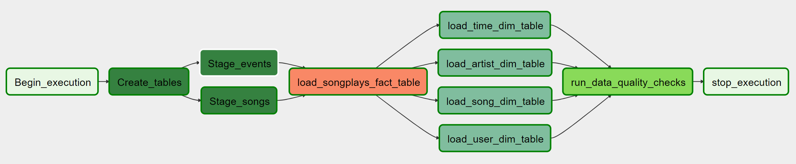

# Author: khoa.nguyen.acb@gmail.com
# Project: Data Pipelines with Airflow

A music streaming company, Sparkify, has decided that it is time to introduce more automation and monitoring to their data warehouse ETL pipelines and come to the conclusion that the best tool to achieve this is Apache Airflow.

They have decided to bring you into the project and expect you to create high grade data pipelines that are dynamic and built from reusable tasks, can be monitored, and allow easy backfills. They have also noted that the data quality plays a big part when analyses are executed on top the data warehouse and want to run tests against their datasets after the ETL steps have been executed to catch any discrepancies in the datasets.

The source data resides in S3 and needs to be processed in Sparkify's data warehouse in Amazon Redshift. The source datasets consist of JSON logs that tell about user activity in the application and JSON metadata about the songs the users listen to.

##  Dataset:
- **Log data:** 
>  s3://udacity-dend/log_data
>
>  s3://udacity-dend/log_data/2018/11/2018-11-01-events.json
>
>  ......................
>
>  s3://udacity-dend/log_data/2018/11/2018-11-30-events.json

- **Song data:** 
> s3://udacity-dend/song_data
>
>  s3://udacity-dend/song_data/A/A/A/TRAAAAK128F9318786.json
>
>  ......................
>
>  s3://udacity-dend/song_data/A/Z/Z/TRAZZXH128F933D2BA.json

## Project Template:
- **airflow/list_keys_dag.py:** Listing all keys in S3 bucket. It is the firt look for the datasets we are dealing with. Done detaily at Project 3 - Data warehouse with Redshift.
- **airflow/plugins/operators/create_table.py:** Custom operator plugins to create the staging and fact/dimension tables in Redshift.
- **airflow/plugins/operators/create_table.sql:** SQL commands to create the staging and fact/dimension tables. 

## DAG:

